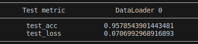
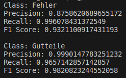

# Anomaly Detection

## Installation
`pip install lightning torch torchvision`
## Dataset Preparation
Download the `images` folder from Gitlab, put it under the root folder.  
The structure of `images` folder should look like below:
```
images  #https://git.rwth-aachen.de/justin.pratt/ki-demonstrator/-/tree/main/images
├── blue
├── Fehler
├── Gutteile
├── red
└── yellow
```
## Current Training Results

This is the result on 20% shuffled images of these 2 classes.

## F1 Score

These are the F1 scores calculated on ALL images of these 2 classes. The inferences results of every image will be saved in `output.csv`.

## Training
Run `train.py` under the root folder of this repo with the path of the `images` folder, accelerator, batch_size, test_split, num_workers, img_size and backbone.
The order of `class_weights` is `Fehler: 0, Gutteile: 1`. If we assign greater weights of Fehler, then the model will focus on this class more.
For example:
```
python train.py --data_path "/home/user/Desktop/images" \
                --accelerator "cpu" \
                --max_epochs 50 \
                --batch_size 8 \
                --test_split 0.2 \
                --num_workers 15 \
                --img_size 640 480 \
                --backbone "resnet18" \
                --class_weights 5.0 1.0 \
                --lr 1e-3
```
Default settings of these parsers:
* data_path must be given
* accelerator: 'cpu'
* max_epochs: 50
* batch_size: 8
* test_split: 0.2
* num_workers: 15
* img_size: [640, 480]
* backbone: 'resnet18'
* class_weights: [5.0, 1.0]
* lr: 1e-3

The pretrained weights in torchvision.models:
https://pytorch.org/vision/stable/models.html#classification
If the resnet18 is still too big for Raspberry Pi, you may try mobilenet_v3_small or mobilenet_v2_small.

## Model Saving
After training, the weights of the model will be saved as `weights.pth` under the root folder.

## Testing
Run `test.py` under the root folder of this repo with the same parsers of `train.py`. The test will be conducted on all the images of these 2 classes (Gutteile+Fehler) and the results will be saved as a `.csv` file under the root folder. `weights.pth` needs to be placed under the root folder.
For example:
```
python test.py --data_path "/home/user/Desktop/images" \
               --weights_path "/home/user/Desktop/Anomaly_Detection/weights.pth" \
               --output_path "/home/user/Desktop/Anomaly_Detection/output.csv" \
               --batch_size 8 \
               --img_size 640 480 \
               --backbone "resnet18" \
               --class_weights 5.0 1.0
```
Default settings of these parsers:
* data_path must be given
* weights_path: current_dir
* output_path: current_dir
* batch_size: 8
* img_size: [640, 480]
* backbone: 'resnet18'

## Possibilities of Improvements
* `class_weights` can be tuned to force the model concentrate on Fehler, if the performance on Fehler is not that satisfied.
* May try to add more parameters between the feature extracted by the pretrained model and the output.
* May try to add augmentation of images during the training.
* Finally: may consider removing the bricks which with the kinds of the Fehler that are hard for the model to predict before the presentation. Just refer to `output.csv` to find these kinds of the Fehler.